# Ứng dụng Đăng ký Nhóm và Chọn Đề tài Môn học

Ứng dụng Flutter hỗ trợ sinh viên lập nhóm học tập, gửi yêu cầu tham gia nhóm và đăng ký nguyện vọng chọn đề tài đồ án môn học. Hệ thống sử dụng Supabase Auth phục vụ quá trình tự đăng ký/đăng nhập của người dùng.

---

## 1. Danh sách Actor và Chức năng Chi tiết

### A. Quản trị viên (Admin)
*   **Dashboard (Tổng quan):** Xem các số liệu thống kê tổng hợp của hệ thống.
*   **Quản lý người dùng:** 
    *   Xem danh sách các tài khoản tự đăng ký qua hệ thống.
    *   **Phân quyền vai trò:** Thay đổi vai trò người dùng (Giảng viên, Sinh viên, Quản trị viên). Mặc định khi đăng ký tài khoản mới sẽ là vai trò **Sinh viên**.
    *   **Khóa / Mở khóa:** Đổi trạng thái hoạt động của tài khoản người dùng.
*   **Quản lý lớp đồ án (CRUD Lớp):** 
    *   Tạo lớp đồ án mới.
    *   Sửa đổi thông tin lớp đồ án.
    *   Xóa lớp đồ án.
    *   Phân công Giảng viên phụ trách lớp.
*   **Quản lý ghi danh:** Thực hiện ghi danh sinh viên vào lớp đồ án.

### B. Giảng viên (Lecturer)
*   **Dashboard (Tổng quan):** Theo dõi sát sao các số liệu lớp mình phụ trách:
    *   Xem số lượng nhóm đồ án đã thành lập.
    *   Xem số lượng đề tài đã công bố.
    *   Xem số lượng đề tài đã được gán cho nhóm.
    *   Xem số lượng nguyện vọng đang chờ duyệt.
*   **Lớp đồ án:** 
    *   Xem danh sách các lớp học được phân công phụ trách.
    *   Xem chi tiết thông tin lớp học.
    *   *(Không có quyền Tạo lớp, Xóa lớp hay Thay đổi giảng viên phụ trách)*
*   **Quản lý đề tài (CRUD Đề tài):** 
    *   Thêm mới đề tài: Tự động gán `giang_vien_id` của giảng viên tạo. Dropdown lớp đồ án chỉ hiển thị các lớp giảng viên được phân công.
    *   Sửa thông tin đề tài.
    *   Xóa đề tài: **Không cho phép xóa đề tài khi đã có nhóm nhận đề tài** (`nhom_id != null`) để đảm bảo tính toàn vẹn dữ liệu.
    *   Công bố đề tài (Trạng thái: *Bản nháp, Đã công bố, Đóng*).
*   **Thành viên nhóm:** Theo dõi danh sách chi tiết các nhóm và các thành viên thuộc từng nhóm của lớp mình phụ trách.
*   **Duyệt nguyện vọng:** 
    *   Xem danh sách nguyện vọng đăng ký đề tài của các nhóm.
    *   Duyệt nguyện vọng: Hệ thống tự động gán ID của nhóm vào cột `nhom_id` của đề tài tương ứng, đồng thời **tự động chuyển các nguyện vọng khác của cùng nhóm đó sang trạng thái Từ chối** để tránh nhóm nhận nhiều đề tài.
*   **Hồ sơ cá nhân:** Xem và cập nhật thông tin cá nhân.

### C. Sinh viên (Student)
*   **Dashboard (Tổng quan):** Xem thông tin lớp học, nhóm của mình và đề tài đã được nhận.
*   **Nhóm của lớp:** Xem danh sách nhóm trong lớp, tự tạo nhóm mới (khi tạo nhóm sẽ tự động giữ vai trò **Nhóm trưởng**).
*   **Yêu cầu vào nhóm:** 
    *   Sinh viên tự do: Gửi yêu cầu gia nhập vào một nhóm khác.
    *   Nhóm trưởng: Duyệt hoặc từ chối yêu cầu gia nhập của sinh viên khác.
*   **Thành viên nhóm:** Xem danh sách đầy đủ các thành viên và vai trò cụ thể trong nhóm hiện tại của mình.
*   **Đề tài công bố:** Xem danh sách đề tài đã được công bố của lớp.
*   **Nguyện vọng đề tài:** 
    *   **Chỉ nhóm trưởng mới được đăng ký nguyện vọng đề tài** (đăng ký thứ tự ưu tiên đề tài cho nhóm).
    *   Thành viên thường chỉ có quyền xem nguyện vọng đã đăng ký của nhóm.
*   **Hồ sơ cá nhân:** Xem và cập nhật thông tin cá nhân.

---

## 2. Quy trình hoạt động chuẩn hóa (Flow) & Ánh xạ Cơ sở dữ liệu

Quy trình tuần tự của ứng dụng ăn khớp chặt chẽ với các bảng dữ liệu trong cơ sở dữ liệu Supabase:

```mermaid
graph TD
    A[1. Sinh viên đăng ký tài khoản mới] -->|Lưu bảng: ho_so <br/> Vai trò mặc định: sinh_vien| B[2. Admin tạo lớp đồ án mới]
    B -->|Tác động bảng: lop_do_an| C[3. Admin phân công Giảng viên phụ trách]
    C -->|Cập nhật cột giang_vien_id trong lop_do_an| D[4. Admin ghi danh sinh viên vào lớp]
    D -->|Tác động bảng: ghi_danh <br/> sử dụng sinh_vien_id đã có ở Bước 1| E[5. Sinh viên tạo nhóm mới]
    E -->|Tác động bảng: nhom_do_an, thanh_vien_nhom <br/> Người tạo mặc định là nhom_truong| F[6. Sinh viên gửi yêu cầu vào nhóm]
    F -->|Tác động bảng: yeu_cau_vao_nhom| G[7. Nhóm trưởng duyệt yêu cầu gia nhập]
    G -->|Tác động bảng: thanh_vien_nhom| H[8. Giảng viên công bố đề tài đồ án]
    H -->|Tác động bảng: de_tai| I[9. Nhóm trưởng đăng ký nguyện vọng đề tài]
    I -->|Tác động bảng: nguyen_vong_de_tai <br/> chỉ dành cho Nhóm trưởng| K[10. Giảng viên duyệt nguyện vọng]
    K -->|Tác động bảng: nguyen_vong_de_tai| L[11. Đề tài được gán cho nhóm]
    L -->|Cập nhật cột nhom_id trong bảng de_tai| M((Hoàn tất đăng ký đề tài))

    style A fill:#e1f5fe,stroke:#0288d1,stroke-width:2px
    style D fill:#efebe9,stroke:#5d4037,stroke-width:2px
    style E fill:#e8f5e9,stroke:#388e3c,stroke-width:2px
    style I fill:#fff3e0,stroke:#f57c00,stroke-width:2px
    style L fill:#ffebee,stroke:#d32f2f,stroke-width:2px
```

